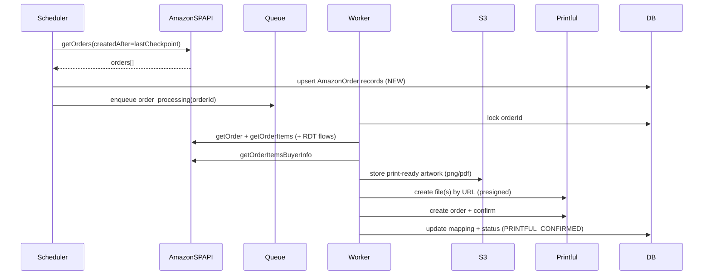
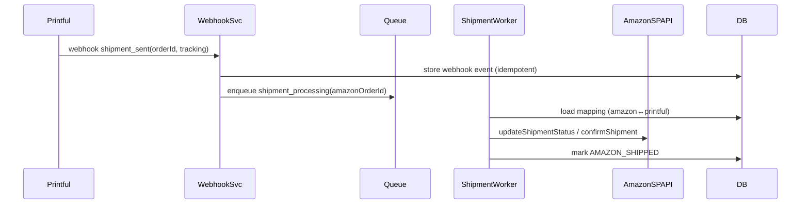

# System architecture

## Recommended architecture (event-driven, idempotent)

### Components

1. **API / Webhook Service**
   - Receives Printful webhooks
   - (Optional) Receives Amazon SP-API Notifications (SNS) callbacks
   - Provides admin endpoints: retry, inspect, reconcile

2. **Scheduler / Ingestor**
   - Polls Amazon SP-API `getOrders` at a fixed cadence (MVP)
   - Enqueues newly discovered orders for processing

3. **Order Processor Worker**
   - For each Amazon order:
     - fetch order details
     - fetch item buyer/customization info
     - fetch shipping address (RDT if needed)
     - render print file(s)
     - store print file(s) (S3) and create Printful file library objects
     - create + confirm Printful order

4. **Shipment Processor Worker**
   - Triggered by Printful webhook “shipment sent”
   - Updates Amazon shipment/tracking via SP-API

5. **Persistent storage**
   - Relational DB (Postgres) or DynamoDB
   - Stores:
     - order state machine status
     - item mapping
     - idempotency keys
     - correlation ids: Amazon order id ↔ Printful order id

6. **Object storage**
   - S3 (recommended)
   - Stores:
     - raw customization artifacts (optional)
     - final print-ready files (required)
     - debug renders (optional; short retention)

7. **Queue**
   - SQS / Rabbit / Redis queue
   - At minimum: `order_processing`, `shipment_processing`, `dead_letter`

---

## Why event-driven?

- Amazon order ingestion is spiky.
- Rendering can be slow (image processing).
- Printful order creation should be retried safely.
- A queue + idempotency prevents duplicates and lets you back off on rate limits.

---

## Suggested dataflow (MVP polling approach)

Shipment flow:

---

## Recommended runtime

**MVP (fastest to ship):**
- A single containerized service with:
  - API routes (webhooks + admin)
  - background workers
  - cron/scheduler

**Scale-out:**
- Separate deployments:
  - `api-service`
  - `worker-service`
  - `scheduler-service`

---

## Observability requirements

- Structured logs with correlation ids:
  - `amazon_order_id`
  - `amazon_order_item_id`
  - `printful_order_id`
  - `attempt`
  - `state`

- Metrics:
  - orders processed per hour
  - rendering duration p50/p95
  - Printful order creation failures
  - Amazon shipment update failures
  - queue depth + DLQ depth

- Tracing (optional but helpful):
  - OpenTelemetry spans for external calls:
    - Amazon SP-API
    - Printful API
    - S3 operations

---

## Idempotency strategy (non-negotiable)

Every external side-effect must be idempotent:

- Print file generation:
  - deterministic output key:
    - `s3://bucket/amazon/{orderId}/{orderItemId}/{hash}.png`

- Printful file creation:
  - if Printful “Add a new file” returns existing file for identical URL, exploit that.
  - otherwise store the returned file id in DB keyed by `(orderItemId, placement)`.

- Printful order creation:
  - use a deterministic `external_id` (or equivalent) that includes the Amazon order id
  - add unique constraint in DB: one Printful order per Amazon order

- Amazon shipment update:
  - only submit shipment update once per order
  - store last submitted carrier/tracking and do not resubmit unless changed

